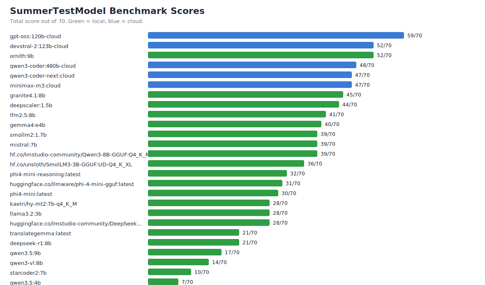

# SummerTestModel

A reproducible benchmark set for comparing local and cloud Ollama models on practical agent tasks. The benchmark focuses on small local models up to about 9B parameters plus selected cloud models connected through Ollama.



## Summary

- Best overall callable model in this run: `gpt-oss:120b-cloud` with 59/70.
- Best local model in this run: `ornith:9b` with 52/70.
- Best cloud model in this run: `gpt-oss:120b-cloud` with 59/70.
- Models that require subscription access were removed from this published dataset and are not treated as tested.
- Scores are automatic first-pass scores. They are useful for regression tracking and triage, but high-impact conclusions should still be reviewed manually.

## Test Content

The 2026-06-29 suite contains seven 10-point tasks:

| Test ID | Capability |
| --- | --- |
| format_json | Format |
| math_reasoning | Math |
| long_context | Retrieval |
| translation_terms | Translation |
| anti_hallucination | Reliability |
| code_bugfix | Code |
| planning_schedule | Planning |

Full prompts are in [benchmark_20260629/test_suite.md](benchmark_20260629/test_suite.md).

## Test Process

- Runner: [benchmark.py](benchmark_20260629/scripts/benchmark.py).
- Interface: Ollama local API `/api/generate`.
- Generation settings: `temperature=0`, `num_predict=900`.
- Raw model outputs: [benchmark_20260629/results/raw](benchmark_20260629/results/raw).
- Machine metadata: [machine.json](benchmark_20260629/results/machine.json).
- Scored outputs: [scores.csv](benchmark_20260629/results/scores.csv) and [scores.xlsx](benchmark_20260629/results/scores.xlsx).

## Test Environment

| Item | Value |
| --- | --- |
| Date | 2026-06-29 |
| OS | Microsoft Windows 11 Home China, 64-bit |
| CPU | 13th Gen Intel(R) Core(TM) i5-13500HX |
| RAM | 31.8 GiB system memory |
| GPU | NVIDIA GeForce RTX 4060 Laptop GPU |
| Ollama | 0.30.11 |

Machine identifiers, usernames, absolute local paths, shell tokens, and temporary directories are intentionally not included.

## Overall Results

| Rank | Model | Type | Score | Percent | Errors | Avg seconds |
| --- | --- | --- | --- | --- | --- | --- |
| 1 | `gpt-oss:120b-cloud` | Cloud | 59/70 | 84.3% | 0 | 6.09 |
| 2 | `devstral-2:123b-cloud` | Cloud | 52/70 | 74.3% | 0 | 8.98 |
| 3 | `ornith:9b` | Local | 52/70 | 74.3% | 0 | 36.17 |
| 4 | `qwen3-coder:480b-cloud` | Cloud | 48/70 | 68.6% | 0 | 3.52 |
| 5 | `qwen3-coder-next:cloud` | Cloud | 47/70 | 67.1% | 0 | 2.94 |
| 6 | `minimax-m3:cloud` | Cloud | 47/70 | 67.1% | 0 | 5.63 |
| 7 | `granite4.1:8b` | Local | 45/70 | 64.3% | 0 | 35.1 |
| 8 | `deepscaler:1.5b` | Local | 44/70 | 62.9% | 0 | 17.77 |
| 9 | `lfm2.5:8b` | Local | 41/70 | 58.6% | 0 | 8.96 |
| 10 | `gemma4:e4b` | Local | 40/70 | 57.1% | 0 | 17.83 |
| 11 | `smollm2:1.7b` | Local | 39/70 | 55.7% | 0 | 2.91 |
| 12 | `mistral:7b` | Local | 39/70 | 55.7% | 0 | 11.53 |
| 13 | `phi4-mini-reasoning:latest` | Local | 32/70 | 45.7% | 0 | 57.55 |
| 14 | `phi4-mini:latest` | Local | 30/70 | 42.9% | 0 | 13.73 |
| 15 | `kaelri/hy-mt2:7b-q4_K_M` | Local | 28/70 | 40.0% | 0 | 8.07 |
| 16 | `llama3.2:3b` | Local | 28/70 | 40.0% | 0 | 9.87 |
| 17 | `translategemma:latest` | Local | 21/70 | 30.0% | 0 | 5.91 |
| 18 | `deepseek-r1:8b` | Local | 21/70 | 30.0% | 0 | 90.61 |
| 19 | `qwen3.5:9b` | Local | 17/70 | 24.3% | 0 | 68.57 |
| 20 | `qwen3-vl:8b` | Local | 14/70 | 20.0% | 0 | 104.82 |
| 21 | `starcoder2:7b` | Local | 10/70 | 14.3% | 0 | 18.29 |

## Score Matrix

| Model | Total | Format | Math | Retrieval | Translation | Reliability | Code | Planning |
| --- | --- | --- | --- | --- | --- | --- | --- | --- |
| `gpt-oss:120b-cloud` | 59 | 10 | 10 | 10 | 9 | 10 | 10 | 0 |
| `devstral-2:123b-cloud` | 52 | 4 | 5 | 10 | 9 | 10 | 10 | 4 |
| `ornith:9b` | 52 | 9 | 5 | 10 | 8 | 10 | 10 | 0 |
| `qwen3-coder:480b-cloud` | 48 | 5 | 0 | 10 | 9 | 10 | 10 | 4 |
| `qwen3-coder-next:cloud` | 47 | 5 | 0 | 10 | 9 | 10 | 10 | 3 |
| `minimax-m3:cloud` | 47 | 10 | 0 | 9 | 8 | 10 | 10 | 0 |
| `granite4.1:8b` | 45 | 4 | 0 | 10 | 9 | 10 | 10 | 2 |
| `deepscaler:1.5b` | 44 | 7 | 5 | 9 | 7 | 10 | 4 | 2 |
| `lfm2.5:8b` | 41 | 0 | 5 | 8 | 6 | 10 | 10 | 2 |
| `gemma4:e4b` | 40 | 10 | 0 | 10 | 9 | 10 | 1 | 0 |
| `smollm2:1.7b` | 39 | 5 | 0 | 8 | 6 | 8 | 10 | 2 |
| `mistral:7b` | 39 | 5 | 0 | 4 | 8 | 10 | 10 | 2 |
| `phi4-mini-reasoning:latest` | 32 | 0 | 5 | 9 | 6 | 10 | 0 | 2 |
| `phi4-mini:latest` | 30 | 4 | 0 | 3 | 7 | 10 | 4 | 2 |
| `kaelri/hy-mt2:7b-q4_K_M` | 28 | 5 | 0 | 3 | 2 | 8 | 10 | 0 |
| `llama3.2:3b` | 28 | 5 | 0 | 3 | 9 | 3 | 4 | 4 |
| `translategemma:latest` | 21 | 4 | 0 | 3 | 8 | 5 | 1 | 0 |
| `deepseek-r1:8b` | 21 | 0 | 0 | 2 | 9 | 10 | 0 | 0 |
| `qwen3.5:9b` | 17 | 0 | 0 | 2 | 2 | 3 | 10 | 0 |
| `qwen3-vl:8b` | 14 | 0 | 0 | 2 | 2 | 10 | 0 | 0 |
| `starcoder2:7b` | 10 | 0 | 0 | 2 | 5 | 3 | 0 | 0 |

## Notable Findings

- Overall: `gpt-oss:120b-cloud` is the strongest model in this automated run, especially on JSON, math, retrieval, reliability, code, and translation.
- Local standout: `ornith:9b` is the strongest local <=9B-class result here, matching or beating several cloud models in this task mix.
- Code repair leaders: `gpt-oss:120b-cloud` (10/10), `devstral-2:123b-cloud` (10/10), `ornith:9b` (10/10), `qwen3-coder:480b-cloud` (10/10), `qwen3-coder-next:cloud` (10/10).
- Anti-hallucination leaders: `gpt-oss:120b-cloud` (10/10), `devstral-2:123b-cloud` (10/10), `ornith:9b` (10/10), `qwen3-coder:480b-cloud` (10/10), `qwen3-coder-next:cloud` (10/10).
- Planning remains the hardest task: best planning scores were `devstral-2:123b-cloud` (4/10), `qwen3-coder:480b-cloud` (4/10), `llama3.2:3b` (4/10), `qwen3-coder-next:cloud` (3/10), `granite4.1:8b` (2/10).

## Repository Layout

```text
benchmark_20260629/
  scripts/benchmark.py       # benchmark runner and auto-graders
  test_suite.md              # prompts and task definitions
  results/scores.csv         # sanitized scored results
  results/scores.xlsx        # spreadsheet view of scored results
  results/raw/               # raw model answers
  results/machine.json       # non-private machine metadata
docs/score_chart.svg         # README summary chart
```

## Notes

- The benchmark intentionally mixes general tasks and agent-relevant tasks, so specialist models may look weak outside their intended domain.
- `qwen3-embedding` was excluded because it is an embedding model, not a text generation model.
- Subscription-gated cloud models were removed from this dataset rather than published as failures.
