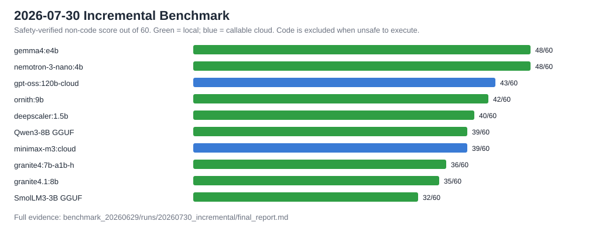

# SummerTestModel

A reproducible benchmark set for comparing local and cloud Ollama models on practical agent tasks. The benchmark focuses on small local models up to about 9B parameters plus selected cloud models connected through Ollama.



## Summary

- Best overall callable model in this run: `gpt-oss:120b-cloud` with 59/70.
- Best local model in this run: `ornith:9b` with 52/70.
- Best cloud model in this run: `gpt-oss:120b-cloud` with 59/70.
- Added 5 new local GGUF/Ollama models on 2026-07-01 and merged them into the same scoring table.
- Models that require subscription access were removed from this published dataset and are not treated as tested.
- Scores are automatic first-pass scores. They are useful for regression tracking and triage, but high-impact conclusions should still be reviewed manually.

## Newly Added Models - 2026-07-01

| Model | Score | Overall Rank |
| --- | --- | --- |
| `hf.co/lmstudio-community/Qwen3-8B-GGUF:Q4_K_M` | 39/70 | 13 |
| `hf.co/unsloth/SmolLM3-3B-GGUF:UD-Q4_K_XL` | 36/70 | 14 |
| `huggingface.co/llmware/phi-4-mini-gguf:latest` | 31/70 | 16 |
| `huggingface.co/lmstudio-community/DeepSeek-R1-0528-Qwen3-8B-GGUF:latest` | 28/70 | 20 |
| `qwen3.5:4b` | 7/70 | 26 |

## Test Content

The suite contains seven 10-point tasks:

| Test ID | Capability |
| --- | --- |
| format_json | Format |
| math_reasoning | Math |
| long_context | Retrieval |
| translation_terms | Translation |
| anti_hallucination | Reliability |
| code_bugfix | Code |
| planning_schedule | Planning |

Full prompts are in [benchmark_20260629/test_suite.md](benchmark_20260629/test_suite.md).

## Test Process

- Runner: [benchmark.py](benchmark_20260629/scripts/benchmark.py).
- Interface: Ollama local API `/api/generate`.
- Generation settings: `temperature=0`, `num_predict=900`.
- Raw model outputs: [benchmark_20260629/results/raw](benchmark_20260629/results/raw).
- Machine metadata: [machine.json](benchmark_20260629/results/machine.json).
- Scored outputs: [scores.csv](benchmark_20260629/results/scores.csv) and [scores.xlsx](benchmark_20260629/results/scores.xlsx).

## Test Environment

| Item | Value |
| --- | --- |
| Date | 2026-06-29 initial run; 2026-07-01 incremental run |
| OS | Microsoft Windows 11 Home China, 64-bit |
| CPU | 13th Gen Intel(R) Core(TM) i5-13500HX |
| RAM | 31.8 GiB system memory |
| GPU | NVIDIA GeForce RTX 4060 Laptop GPU |
| Ollama | 0.30.11 |

Machine identifiers, usernames, absolute local paths, shell tokens, and temporary directories are intentionally not included.

## Overall Results

| Rank | Model | Type | Score | Percent | Errors | Avg seconds |
| --- | --- | --- | --- | --- | --- | --- |
| 1 | `gpt-oss:120b-cloud` | Cloud | 59/70 | 84.3% | 0 | 6.09 |
| 2 | `devstral-2:123b-cloud` | Cloud | 52/70 | 74.3% | 0 | 8.98 |
| 3 | `ornith:9b` | Local | 52/70 | 74.3% | 0 | 36.17 |
| 4 | `qwen3-coder:480b-cloud` | Cloud | 48/70 | 68.6% | 0 | 3.52 |
| 5 | `qwen3-coder-next:cloud` | Cloud | 47/70 | 67.1% | 0 | 2.94 |
| 6 | `minimax-m3:cloud` | Cloud | 47/70 | 67.1% | 0 | 5.63 |
| 7 | `granite4.1:8b` | Local | 45/70 | 64.3% | 0 | 35.1 |
| 8 | `deepscaler:1.5b` | Local | 44/70 | 62.9% | 0 | 17.77 |
| 9 | `lfm2.5:8b` | Local | 41/70 | 58.6% | 0 | 8.96 |
| 10 | `gemma4:e4b` | Local | 40/70 | 57.1% | 0 | 17.83 |
| 11 | `smollm2:1.7b` | Local | 39/70 | 55.7% | 0 | 2.91 |
| 12 | `mistral:7b` | Local | 39/70 | 55.7% | 0 | 11.53 |
| 13 | `hf.co/lmstudio-community/Qwen3-8B-GGUF:Q4_K_M` | Local | 39/70 | 55.7% | 0 | 38.76 |
| 14 | `hf.co/unsloth/SmolLM3-3B-GGUF:UD-Q4_K_XL` | Local | 36/70 | 51.4% | 0 | 13.81 |
| 15 | `phi4-mini-reasoning:latest` | Local | 32/70 | 45.7% | 0 | 57.55 |
| 16 | `huggingface.co/llmware/phi-4-mini-gguf:latest` | Local | 31/70 | 44.3% | 0 | 14.67 |
| 17 | `phi4-mini:latest` | Local | 30/70 | 42.9% | 0 | 13.73 |
| 18 | `kaelri/hy-mt2:7b-q4_K_M` | Local | 28/70 | 40.0% | 0 | 8.07 |
| 19 | `llama3.2:3b` | Local | 28/70 | 40.0% | 0 | 9.87 |
| 20 | `huggingface.co/lmstudio-community/DeepSeek-R1-0528-Qwen3-8B-GGUF:latest` | Local | 28/70 | 40.0% | 0 | 81.88 |
| 21 | `translategemma:latest` | Local | 21/70 | 30.0% | 0 | 5.91 |
| 22 | `deepseek-r1:8b` | Local | 21/70 | 30.0% | 0 | 90.61 |
| 23 | `qwen3.5:9b` | Local | 17/70 | 24.3% | 0 | 68.57 |
| 24 | `qwen3-vl:8b` | Local | 14/70 | 20.0% | 0 | 104.82 |
| 25 | `starcoder2:7b` | Local | 10/70 | 14.3% | 0 | 18.29 |
| 26 | `qwen3.5:4b` | Local | 7/70 | 10.0% | 0 | 28.78 |

## Score Matrix

| Model | Total | Format | Math | Retrieval | Translation | Reliability | Code | Planning |
| --- | --- | --- | --- | --- | --- | --- | --- | --- |
| `gpt-oss:120b-cloud` | 59 | 10 | 10 | 10 | 9 | 10 | 10 | 0 |
| `devstral-2:123b-cloud` | 52 | 4 | 5 | 10 | 9 | 10 | 10 | 4 |
| `ornith:9b` | 52 | 9 | 5 | 10 | 8 | 10 | 10 | 0 |
| `qwen3-coder:480b-cloud` | 48 | 5 | 0 | 10 | 9 | 10 | 10 | 4 |
| `qwen3-coder-next:cloud` | 47 | 5 | 0 | 10 | 9 | 10 | 10 | 3 |
| `minimax-m3:cloud` | 47 | 10 | 0 | 9 | 8 | 10 | 10 | 0 |
| `granite4.1:8b` | 45 | 4 | 0 | 10 | 9 | 10 | 10 | 2 |
| `deepscaler:1.5b` | 44 | 7 | 5 | 9 | 7 | 10 | 4 | 2 |
| `lfm2.5:8b` | 41 | 0 | 5 | 8 | 6 | 10 | 10 | 2 |
| `gemma4:e4b` | 40 | 10 | 0 | 10 | 9 | 10 | 1 | 0 |
| `smollm2:1.7b` | 39 | 5 | 0 | 8 | 6 | 8 | 10 | 2 |
| `mistral:7b` | 39 | 5 | 0 | 4 | 8 | 10 | 10 | 2 |
| `hf.co/lmstudio-community/Qwen3-8B-GGUF:Q4_K_M` | 39 | 10 | 0 | 10 | 9 | 10 | 0 | 0 |
| `hf.co/unsloth/SmolLM3-3B-GGUF:UD-Q4_K_XL` | 36 | 2 | 5 | 9 | 6 | 10 | 0 | 4 |
| `phi4-mini-reasoning:latest` | 32 | 0 | 5 | 9 | 6 | 10 | 0 | 2 |
| `huggingface.co/llmware/phi-4-mini-gguf:latest` | 31 | 5 | 0 | 3 | 6 | 3 | 10 | 4 |
| `phi4-mini:latest` | 30 | 4 | 0 | 3 | 7 | 10 | 4 | 2 |
| `kaelri/hy-mt2:7b-q4_K_M` | 28 | 5 | 0 | 3 | 2 | 8 | 10 | 0 |
| `llama3.2:3b` | 28 | 5 | 0 | 3 | 9 | 3 | 4 | 4 |
| `huggingface.co/lmstudio-community/DeepSeek-R1-0528-Qwen3-8B-GGUF:latest` | 28 | 0 | 5 | 9 | 7 | 5 | 0 | 2 |
| `translategemma:latest` | 21 | 4 | 0 | 3 | 8 | 5 | 1 | 0 |
| `deepseek-r1:8b` | 21 | 0 | 0 | 2 | 9 | 10 | 0 | 0 |
| `qwen3.5:9b` | 17 | 0 | 0 | 2 | 2 | 3 | 10 | 0 |
| `qwen3-vl:8b` | 14 | 0 | 0 | 2 | 2 | 10 | 0 | 0 |
| `starcoder2:7b` | 10 | 0 | 0 | 2 | 5 | 3 | 0 | 0 |
| `qwen3.5:4b` | 7 | 0 | 0 | 2 | 2 | 3 | 0 | 0 |

## Notable Findings

- Overall: `gpt-oss:120b-cloud` is the strongest model in this automated run, especially on JSON, math, retrieval, reliability, code, and translation.
- Local standout: `ornith:9b` is the strongest local <=9B-class result here, matching or beating several cloud models in this task mix.
- Among newly added models, `hf.co/lmstudio-community/Qwen3-8B-GGUF:Q4_K_M` ranked highest at 39/70.
- Code repair leaders: `gpt-oss:120b-cloud` (10/10), `devstral-2:123b-cloud` (10/10), `ornith:9b` (10/10), `qwen3-coder:480b-cloud` (10/10), `qwen3-coder-next:cloud` (10/10).
- Anti-hallucination leaders: `gpt-oss:120b-cloud` (10/10), `devstral-2:123b-cloud` (10/10), `ornith:9b` (10/10), `qwen3-coder:480b-cloud` (10/10), `qwen3-coder-next:cloud` (10/10).
- Planning remains the hardest task: best planning scores were `devstral-2:123b-cloud` (4/10), `qwen3-coder:480b-cloud` (4/10), `hf.co/unsloth/SmolLM3-3B-GGUF:UD-Q4_K_XL` (4/10), `huggingface.co/llmware/phi-4-mini-gguf:latest` (4/10), `llama3.2:3b` (4/10).

## Repository Layout

```text
benchmark_20260629/
  scripts/benchmark.py       # benchmark runner and auto-graders
  test_suite.md              # prompts and task definitions
  results/scores.csv         # sanitized scored results
  results/scores.xlsx        # spreadsheet view of scored results
  results/raw/               # raw model answers
  results/machine.json       # non-private machine metadata
docs/score_chart.svg         # README summary chart
```

## Latest Incremental Run - 2026-07-30

The 2026-07-30 unattended run is stored separately from the historical 2026-06-29/07-01 data. It recorded 288 structured results across the currently installed model inventory. See [the run report](benchmark_20260629/runs/20260730_incremental/final_report.md), [validated core scores](benchmark_20260629/runs/20260730_incremental/core_validated.csv), [specialist scores](benchmark_20260629/runs/20260730_incremental/specialist_validated.csv), and [the workbook](benchmark_20260629/runs/20260730_incremental/scores.xlsx).

- Safe non-code comparison (60 points): `gemma4:e4b` and `nemotron-3-nano:4b` tied at 48/60; `gpt-oss:120b-cloud` scored 43/60.
- Strict fully scored 70-point subset: `deepscaler:1.5b` led at 44/70, followed by `hf.co/unsloth/SmolLM3-3B-GGUF:UD-Q4_K_XL` and `phi4-mini-reasoning:latest` at 33/70.
- Specialist tracks remain separate: `qwen3-embedding:latest` reached 6/6 on the local retrieval set; `qwen3-vl:8b` achieved 2/2 exact visual extractions. OCR/vision content correctness and strict output-format correctness are reported separately.
- `devstral-2:123b-cloud`, `qwen3-coder:480b-cloud`, and `qwen3-coder-next:cloud` returned HTTP 410 for every request and are reported as unavailable, not as zero-capability models.
- The code task is now safety-gated. Answers that cannot pass an AST allowlist and isolated subprocess check are `unsafe_to_execute`; they are excluded from the strict 70-point total instead of executing untrusted model output.

## Notes

- The benchmark intentionally mixes general tasks and agent-relevant tasks, so specialist models may look weak outside their intended domain.
- `qwen3-embedding` was excluded because it is an embedding model, not a text generation model.
- Subscription-gated cloud models were removed from this dataset rather than published as failures.

## 20260731_v2_comprehensive

### V2 Stable Snapshot

本节是基于既有 raw evidence 的离线收口，不恢复中断任务，也不新增模型、题库或全量重测。它与 V1 七题 70 分榜及 20260730 incremental run 独立，三者不能混合排名。

- Task version：`20260731.v2`；publication scorer：`v2.2.0-offline`。
- 运行目录：[V2 comprehensive](benchmark_20260629/runs/20260731_v2_comprehensive/)。
- 清单模型：44（本地 39，cloud 5）；有实际记录模型：33。
- canonical 记录：1567；原始尝试：1974；可评分：1246；基础设施失败：263。
- raw response、`results.jsonl` 和 legacy scores 保持不变；`offline_regrade.csv` 并列保存 legacy 与 publication 派生结果。

### Comparison Boundaries

- General/Core、Reasoning、Code、Translation、Vision、OCR、Safety、Tools 分别展示；specialist 不进入普通 Core 总榜。
- 仅有可评分记录进入能力得分分母；network/server/timeout/unavailable 不作为能力 0 分。
- coverage 表示该模型在此赛道已有记录的完成比例，不表示整个模型清单覆盖率。OCR 分数为文本语义重叠，重复退化/截断仍由 coverage 和状态单列。long-context、embedding、performance 与 robustness 没有足够 V2 数据时不建立榜单。

### Existing-data Results

| 赛道 | 第一名 | 得分 | 已有记录 coverage |
| --- | --- | ---: | ---: |
| core | `hf.co/tiiuae/Falcon-H1R-7B-GGUF:Q4_K_M` | 247/310 | 100.0% |
| reasoning | `olmo-3:7b-think` | 70/70 | 70.0% |
| code | `olmo-3:7b-think` | 23.333333333333332/40 | 40.0% |
| translation | `huggingface.co/lmstudio-community/DeepSeek-R1-0528-Qwen3-8B-GGUF:latest` | 80/80 | 100.0% |
| long_context | 无适用终态 | - | 0 |
| vision | `qwen3.5:9b` | 3.8/5 | 100.0% |
| ocr | `glm-ocr:latest` | 3.8/5 | 0.0% |
| safety | `granite4.1-guardian:8b` | 4/4 | 100.0% |
| tool | `functiongemma:270m` | 3/8 | 37.5% |
| embedding | 无适用终态 | - | 0 |
| performance | 无适用终态 | - | 0 |
| robustness | 无适用终态 | - | 0 |

完整报告：[final_report.md](benchmark_20260629/runs/20260731_v2_comprehensive/final_report.md)；表格：[all_results.csv](benchmark_20260629/runs/20260731_v2_comprehensive/all_results.csv)、[scores.xlsx](benchmark_20260629/runs/20260731_v2_comprehensive/scores.xlsx)；失败分类：[failures.csv](benchmark_20260629/runs/20260731_v2_comprehensive/failures.csv)。

### Reproduce and Increment

1. `ollama pull <model>`，再运行 capability reconnaissance；不要以模型名猜测能力。
2. 只对新模型运行适用赛道，使用独立 run directory，并保留 raw response、digest 与状态。
3. 中断后使用同一 run directory resume；终态记录会被跳过，不能覆盖既有有效结果。
4. 使用 `regrade_v2_offline.py` 和 `finalize_v2.py` 从已有 raw 重新生成派生报告。
5. 只有 benchmark major version、scorer 无法离线重评、Ollama 推理行为发生重大变化或用户明确要求时，才考虑全量重测。

V2 使用流式响应、每题持久化、独立任务/评分器版本、受限代码子进程和显式 cloud preflight；截断、策略拒绝、不可用与传输失败不混为能力 0 分。已知限制和未来补测见 [docs/current_project_status.md](docs/current_project_status.md) 与 [docs/future_work.md](docs/future_work.md)。
