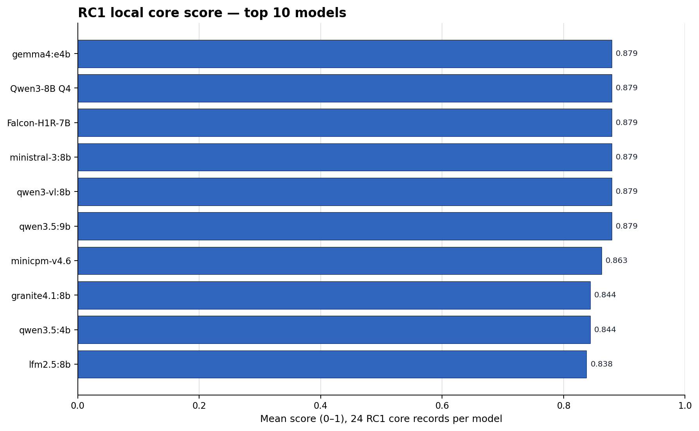
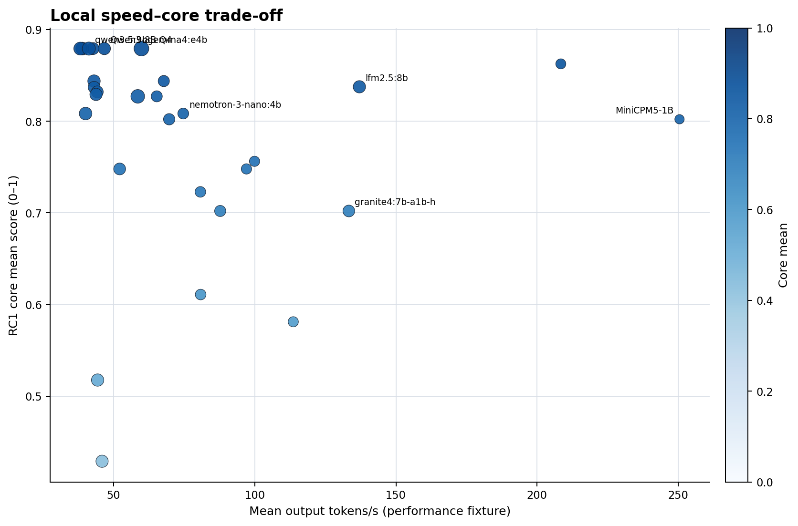
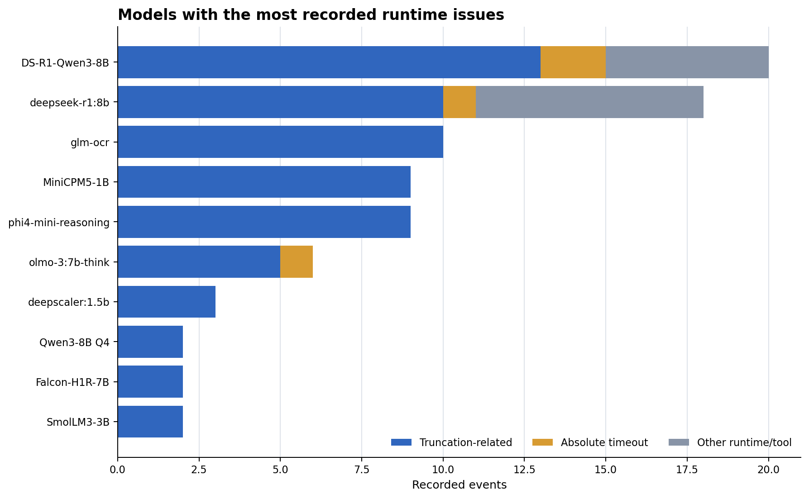

# SummerTestModel Benchmark 1.0-rc1 阶段最终报告

[中文] · [English](final_report.en.md)

## 技术摘要：这次 RC1 应当成为后续增量评测的唯一基线

本阶段完成了 39/39 个本地模型、1,938 道适用任务的正式执行，并在独立范围内完成 2 个云端模型的 142 条参考记录。随后对全部 1,938 条 raw 做了实用型离线重评，并只针对 8 个模型的 50 条超时、截断或工具异常记录执行一次宽松恢复；39 条恢复证据被选入实用快照，6 条仍无可评分 final。严格基线及其 raw 完全保留，没有缺失 raw、重复 inference key、评分错误或基础设施缺口。

这份结果最有价值的不是产生一个“万能总榜”，而是建立了以后可以持续追加模型的规范：固定任务与评分器、按能力分赛道、记录 digest/量化/运行环境、基础设施失败不计能力 0 分、评分更新优先离线重评。当前最实用的结论是：

- **默认本地通用/Agent 参考**：`Qwen3-8B Q4_K_M` 与 `qwen3-vl:8b`；两者 Core 都为 0.879、Tools 都为 0.909、Long Context 都为 1.000，后者在本轮 Code 0.890、Vision 1.000。
- **通用与长上下文**：`gemma4:e4b`、`qwen3.5:9b` 和上述两个 Qwen；这些模型在实用评分下长上下文均达到 1.000，但题量只有 4 条，不能外推为极限上下文能力。
- **速度优先**：`granite4:7b-a1b-h`、`lfm2.5:8b`、`MiniCPM5-1B`；高吞吐不等于高通用分，应按工具/代码/翻译等具体用途使用。
- **代码**：`olmo-3:7b-think` 0.900、`qwen3-vl:8b` 0.890、`ornith:9b` 0.810、`deepseek-r1:8b` 0.775；必须与各自超时、截断和来源风险一起阅读。
- **专用模型**：嵌入选 `qwen3-embedding`，安全分类选 `Granite Guardian`。OCR 中 `GLM-OCR` 语义分 0.810 但完成率为 0%，`DeepSeek-OCR` 0.792 且完成率 100%，两者不能只按分数排序。
- **医疗**：`nemotron-3-nano:4b`、`qwen3.5:4b` 和 `qwen3.5:9b` 在当前夹具均为 0.800；这不是临床有效性或安全性证明。

图 1：39 个本地模型中具有 Core 记录的模型比较；每个模型 24 条 Core 记录，分数为 0–1 的赛道均值。

## 为什么这样设计：测“这台电脑上的可用性”，而不是复制厂商排行榜

1. **本地范围明确**：正式基线只包含本机安装且总参数不超过约 10B 的本地模型。云端模型只作独立参考，避免把硬件约束和服务端能力混成一个榜。
2. **赛道独立**：Core、Reasoning、Code、Translation、Tools、Vision、OCR、Long Context、Embedding、Safety、Medical、Performance 分开解释；没有 universal overall score。否则专用模型会因不适用任务被错误惩罚。
3. **两层运行边界**：严格基线保留原 profile 边界；实用恢复只对预先列出的 50 条异常记录使用一次宽松预算，并明确标注，绝不静默替换原证据。
4. **不使用格式约束解码**：题目要求 JSON 时也不启用 `format=json`，因为协议遵循本身就是被测能力。
5. **Thinking 与 final 分离**：普通赛道不把思维链拼入答案评分；Reasoning 只对元数据声明 thinking 的模型启用。
6. **证据分层**：raw inference、normalized interpretation、scorer output、report/leaderboard 四层分离，因此修改评分器不要求重新推理。
7. **失败分层**：网络/服务不可用与模型错误答案分开；transport failure 最多重试一次，语义错误、超时、截断和 scorer failure 不重试推理。
8. **模型身份稳定**：唯一键包含 benchmark version、task manifest hash、model digest、profile 和 task ID；同名但 digest 改变会成为新 revision。

## 数据、指标与比较边界

| 项目 | 定义 |
| --- | --- |
| 本地样本 | 39 个已安装本地模型；每个模型只运行适用赛道 |
| 任务记录 | 1,938 条本地派生记录；对应 1,938 份本地不可变 raw |
| 严格分数 | 原 RC1 scorer 的固定边界结果，完整保留用于复核 |
| 实用分数 | 对既有 raw 离线重评；仅在恢复产生可评分或更高分结果时选择恢复证据，仍按赛道独立展示 |
| Coverage | 已评分记录 / 当前模型在该赛道的记录数，不表示全模型覆盖 |
| Performance | Ollama 提供的 token/duration 与 wall time；不增加能力得分 |
| Runtime anomaly | 流中断、工具循环、超时、截断等执行表现；与基础设施故障分开 |
| 官方比较 | 仅用于解释模型预期定位；未复现相同数据集、精度、prompt 与 runtime 时不做数值等价比较 |

运行环境为 Windows 11、Intel i5-13500HX、31.8 GiB RAM、RTX 4060 Laptop 8 GiB VRAM。严格基线记录 Ollama 0.32.6，定向恢复记录 0.32.9；项目把版本当作环境元数据，不把某个 patch 版本当作永久门槛。

## 主要结果：质量、速度与稳定性必须一起看

### 1. 均衡能力比单项第一更适合作为默认模型

实用评分下 `Qwen3-8B Q4_K_M` 与 `qwen3-vl:8b` 都达到 Core 0.879、Tools 0.909、Long Context 1.000；前者是稳定的纯文本参考，后者在 Code 0.890 和 Vision 1.000 更突出。`gemma4:e4b` 的 Core 0.879、Translation/Long Context 1.000 也很强，但 Code 只有 0.200。不存在脱离工作负载的唯一冠军。

### 2. 高吞吐与通用能力存在明显取舍

图 2：只有同时具备 Core 与 performance 记录的本地生成模型进入图中；气泡大小近似模型文件大小。Performance 是描述指标，不计能力分。

`MiniCPM5-1B`、`LFM2.5` 和 `Granite 4 7B-A1B` 吞吐很高；实用重评改善了它们的语义/协议归因，但速度仍然不进入能力分。实际部署应先确定任务，再在同一赛道候选中比较吞吐，而不是先做一个速度总榜。

### 3. 推理模型最容易暴露“会想但来不及给 final”的问题

`DeepSeek-R1-0528-Qwen3-8B`、`DeepSeek-R1 8B`、`OLMo Think` 和 `Phi-4-mini-reasoning` 都出现较多截断或 final 前终止。RC1 的 practical-local boundary 使这些现象成为可用性证据：模型可能生成了较长 thinking，但在预算内没有形成可评分 final。

图 3：按记录事件数展示问题较多的模型；这些事件不等价于基础设施失败，也不自动进入能力分母。

### 4. 专用模型必须按原生用途解释

`qwen3-embedding` 在 12 个小型检索查询上为 1.000，但不能声称复现 MTEB。`Granite Guardian` 在 20 个安全样本上为 1.000，适合安全判定而不是聊天。`GLM-OCR` 的语义均值 0.810 与完成率 0% 同时成立，正说明语义正确、重复退化和完成状态必须分开。`StarCoder2` 的基础补全定位也不能直接等同于指令式纯函数能力。

## 按用途推荐

| 用途 | 首选 | 备选 | 为什么 |
| --- | --- | --- | --- |
| 默认本地助手 | Qwen3-8B Q4 | Qwen3-VL 8B、Gemma4 E4B、Nemotron 4B | Core、工具、翻译与长上下文均衡 |
| 代码 | OLMo Think / Qwen3-VL 8B | Ornith 9B、DeepSeek-R1 8B、MiniCPM5 | 实用 Code 0.900 / 0.890；需结合稳定性和来源 |
| 工具调用 | Qwen3-8B / Qwen3-VL / LFM2.5 | Falcon H1R、Gemma4、Qwen3.5 | 头部约 0.90，需同时看循环/未知工具事件 |
| 翻译 | Gemma4 / Qwen3-8B | Granite4.1、Ministral3、TranslateGemma | 本轮翻译 0.967–1.000；专用模型用于对照 |
| 长上下文 | Qwen3-8B / Qwen3-VL / Gemma4 / Qwen3.5 | 多个 1.000 候选 | 仅 4 条夹具，不代表 128K/1M 极限 |
| 低资源/高吞吐 | MiniCPM5 1B | Granite4 A1B、LFM2.5、SmolLM2 | 吞吐高，但通用能力不等价 |
| 安全分类 | Granite Guardian 8B | ShieldGemma 2B | 1.000 对 0.708；后者更省资源 |
| 嵌入检索 | Qwen3 Embedding | 暂无同类对照 | 12/12 小型检索夹具通过 |
| OCR | DeepSeek OCR（实验） | GLM-OCR（语义实验）、Qwen3.5 / Qwen3-VL | 必须同时看语义分与完成率 |
| 医疗文本 | Nemotron 4B / Qwen3.5（研究） | Falcon H1R / MedGemma | 仅代表当前夹具，不能替代医学验证 |

## 逐模型：能力预期、实测与建议

“能力预期”来自安装元数据和发布者模型卡映射；“本机实际表现”只取本次 RC1；“推荐用途/注意事项”是基于二者的项目决策建议，不是新增评分器或 retention 判定。

| 模型 | 规模/量化 | 能力预期 | 本机实际表现 | 推荐用途 | 注意事项 | 来源 |
| --- | --- | --- | --- | --- | --- | --- |
| `deepscaler:1.5b` | 1.8B / F16 | 推理候选 | 长上下文 1.000；通用能力 0.802；推理 0.800；翻译 0.717 | 快速推理或代码草案的低成本候选。 | 工具表现偏弱，且仍有 3 次截断；复杂 Agent 任务需复核。 | [官方来源](https://huggingface.co/agentica-org/DeepScaleR-1.5B-Preview) |
| `deepseek-ocr:latest` | 3.3B / F16 | OCR 专用 | OCR 0.792 | 当前 OCR 赛道中最值得继续研究的本地专用模型。 | 实用语义分 0.792，但题量仍小，尚不足以视为可靠生产 OCR。 | [官方来源](https://huggingface.co/deepseek-ai/DeepSeek-OCR) |
| `deepseek-r1:8b` | 8.2B / Q4_K_M | 推理候选 | 长上下文 1.000；翻译 0.950；推理 0.778（完成 90%）；代码 0.775 | 适合容忍等待时间的代码与翻译辅助。 | 宽松恢复后仍有 1 次超时、1 次截断和 7 次流中断，不适合稳定交互默认模型。 | [官方来源](https://huggingface.co/deepseek-ai/DeepSeek-R1) |
| `functiongemma:270m` | 268.10M / Q8_0 | 工具调用专用 | 工具调用 0.575 | 保留为极小工具路由器研究对象。 | 实用工具分 0.575，适合作为极小路由器实验而非复杂多轮 Agent。 | [官方来源](https://ai.google.dev/gemma/docs/functiongemma/model_card) |
| `gemma3n:e4b` | 6.9B / Q4_K_M | 多模态/通用候选 | 翻译 0.833；通用能力 0.827；代码 0.200 | 轻量翻译、摘要和普通文本任务。 | 代码仅 0.200，当前清单也未确认其多模态执行能力。 | [官方来源](https://huggingface.co/google/gemma-3n-E4B-it) |
| `gemma4:e4b` | 8.0B / Q4_K_M | 视觉/多模态候选 | 翻译 1.000；长上下文 1.000；工具调用 0.905；通用能力 0.879 | 本机通用、翻译和长上下文任务的首选之一。 | 实用重评后代码仍仅 0.200；应按文本/长上下文优势使用。 | [官方来源](https://ai.google.dev/gemma/docs/core/model_card_4) |
| `glm-ocr:latest` | 1.1B / F16 | OCR 专用 | OCR 0.810（完成 0%） | 可作为 OCR 语义识别研究对象，但必须配合去重和终止控制。 | 语义分 0.810，但 10/10 输出截断、完成率 0%；不能按 0.810 当作可交付 OCR。 | [官方来源](https://huggingface.co/zai-org/GLM-OCR) |
| `granite4.1-guardian:8b` | 8.4B / Q6_K | 安全分类专用 | 安全分类 1.000 | 当前安全输入/输出分类的首选专用模型。 | 只应用于安全判定，不应当作聊天模型。 | [官方来源](https://huggingface.co/ibm-granite/granite-guardian-4.1-8b) |
| `granite4.1:8b` | 8.8B / Q4_K_M | 通用候选 | 长上下文 1.000；翻译 0.967；工具调用 0.884；通用能力 0.844 | 稳定的多语言通用助手与企业文本任务候选。 | 代码与工具表现中等，不是本机这两项的第一选择。 | [官方来源](https://huggingface.co/ibm-granite/granite-4.1-8b) |
| `granite4:7b-a1b-h` | 6.9B / Q4_K_M | 通用候选 | 长上下文 1.000；翻译 0.917；工具调用 0.889；通用能力 0.702 | 速度优先的代码、翻译和工具调用候选。 | 实用 Core 为 0.702，但精确上游制品映射仍需确认。 | [官方来源](https://huggingface.co/ibm-granite) |
| `hf.co/ibm-granite/granite-vision-4.1-4b-GGUF:Q4_K_M` | 3.4B / Q4_K_M | 视觉/多模态候选 | 长上下文 1.000；翻译 0.883；视觉 0.875；通用能力 0.702 | 轻量文档视觉集成实验和翻译。 | 视觉 0.875、OCR 0.370；视觉选择题改善明显，但 OCR 仍不可靠。 | [官方来源](https://huggingface.co/ibm-granite/granite-vision-4.1-4b) |
| `hf.co/lmstudio-community/Qwen3-8B-GGUF:Q4_K_M` | 8.19B / Q4_K_M | 通用候选 | 翻译 1.000；长上下文 1.000；工具调用 0.909；通用能力 0.879 | 当前最适合作为默认本地通用/Agent 基线的模型。 | 长上下文实用分 1.000，但只有 4 条夹具且仍有 2 次截断。 | [官方来源](https://huggingface.co/Qwen/Qwen3-8B) |
| `hf.co/tiiuae/Falcon-H1R-7B-GGUF:Q4_K_M` | 7.59B / Q4_K_M | 通用候选 | 长上下文 1.000；翻译 0.950；工具调用 0.907；通用能力 0.879 | 推理、通用与医疗文本的稳健对照模型。 | 代码为 0.500，且性能慢于若干 4B/混合架构模型。 | [官方来源](https://huggingface.co/tiiuae/Falcon-H1R-7B) |
| `hf.co/unsloth/SmolLM3-3B-GGUF:UD-Q4_K_XL` | 3.08B / Q4_K_M | 通用候选 | 长上下文 1.000；翻译 0.850；推理 0.800；通用能力 0.756 | 小体积、快速翻译和轻量文本处理。 | 核心、代码和工具表现弱，不宜承担复杂 Agent 工作。 | [官方来源](https://huggingface.co/HuggingFaceTB/SmolLM3-3B) |
| `huggingface.co/llmware/phi-4-mini-gguf:latest` | 3.84B / Q4_K_M | 通用候选 | 长上下文 1.000；翻译 0.800；通用能力 0.723；工具调用 0.477 | 低占用普通问答和翻译备选。 | 代码 0.315、工具 0.477，复杂任务仍需强校验。 | [官方来源](https://huggingface.co/microsoft/Phi-4-mini-instruct) |
| `huggingface.co/lmstudio-community/DeepSeek-R1-0528-Qwen3-8B-GGUF:latest` | 8.19B / Q4_K_M | 推理候选 | 翻译 0.917；推理 0.800；长上下文 0.750；代码 0.665 | 离线推理或代码草案，适合允许失败重试的研究场景。 | 实用 Core 仅 0.429，且原运行仍保留较多超时、异常与截断证据。 | [官方来源](https://huggingface.co/deepseek-ai/DeepSeek-R1-0528-Qwen3-8B) |
| `kaelri/hy-mt2:7b-q4_K_M` | 7.5B / Q4_K_M | 翻译专用 | 翻译 0.800 | 专用翻译对照模型。 | 翻译 0.800，低于本轮多个通用模型；不要外推到其他能力。 | [官方来源](https://huggingface.co/tencent/Hy-MT2-7B) |
| `lfm2.5:8b` | 8.5B / Q4_K_M | 通用候选 | 长上下文 1.000；工具调用 0.909；翻译 0.883；通用能力 0.838 | 速度优先的工具调用与推理候选。 | 实用 Core 0.838、Tools 0.909，但仍需用更大题集验证泛化。 | [官方来源](https://huggingface.co/LiquidAI/LFM2.5-8B-A1B) |
| `llama3.2:3b` | 3.2B / Q4_K_M | 通用候选 | 长上下文 1.000；翻译 0.867；工具调用 0.820；通用能力 0.748 | 轻量代码、工具调用和多语言文本。 | 实用 Core 0.748；复杂指令仍应结合工具与代码结果复核。 | [官方来源](https://huggingface.co/meta-llama/Llama-3.2-3B-Instruct) |
| `medgemma1.5:4b` | 4.3B / Q4_K_M | 医疗/多模态专用 | 医疗 0.717；OCR 0.488（完成 90%） | 仅用于医疗模型集成诊断和未来定向补测。 | 医疗 0.717、OCR 0.488；题量很小，绝不可用于真实医疗决策。 | [官方来源](https://developers.google.com/health-ai-developer-foundations/medgemma/model-card) |
| `minicpm-v4.6:latest` | 752.16M / Q4_K_M | 视觉/多模态候选 | 长上下文 1.000；翻译 0.933；工具调用 0.909；通用能力 0.863 | 极快的翻译和轻量文本候选。 | 视觉 0.750、OCR 0.463，但本地参数元数据仍存在身份异常。 | [官方来源](https://huggingface.co/openbmb/MiniCPM-V-4_6) |
| `ministral-3:8b` | 8.9B / Q4_K_M | 视觉/多模态候选 | 长上下文 1.000；翻译 0.967；通用能力 0.879；工具调用 0.876 | 均衡的多语言、代码、工具和多模态候选。 | 视觉为 0.750，仍受 8 条小型夹具限制，速度也不占优。 | [官方来源](https://huggingface.co/mistralai/Ministral-3-8B-Instruct-2512) |
| `mistral:7b` | 7.2B / Q4_K_M | 通用候选 | 翻译 0.900；工具调用 0.767；长上下文 0.750；通用能力 0.748 | 稳定的传统 7B 多语言基线。 | 工具 0.767、长上下文 0.750；仍不是当前各赛道首选。 | [官方来源](https://huggingface.co/mistralai/Mistral-7B-Instruct-v0.3) |
| `nemotron-3-nano:4b` | 4.0B / Q4_K_M | 通用候选 | 长上下文 1.000；工具调用 0.826（完成 88%）；通用能力 0.808；推理 0.800 | 4B 级通用、医疗文本和中速 Agent 任务的优先候选。 | 翻译较弱且出现 1 次未知工具调用；医疗结果不代表临床安全。 | [官方来源](https://huggingface.co/nvidia/NVIDIA-Nemotron-3-Nano-4B-FP8) |
| `olmo-3:7b-instruct` | 7.3B / Q4_K_M | 通用候选 | 长上下文 1.000；翻译 0.933；通用能力 0.832；工具调用 0.822 | 开放研究、通用文本和翻译的可解释对照。 | 代码 0.400，综合表现仍未达到本轮最强组。 | [官方来源](https://huggingface.co/allenai/Olmo-3-7B-Instruct) |
| `olmo-3:7b-think` | 7.3B / Q4_K_M | 推理候选 | 长上下文 1.000（完成 75%）；代码 0.900；翻译 0.850；通用能力 0.837（完成 96%） | 允许较长等待时的代码与推理研究。 | 宽松恢复后仍有 2 次 final 前截断和 1 次超时，不适合时间敏感交互。 | [官方来源](https://huggingface.co/allenai/Olmo-3-7B-Think) |
| `openbmb/minicpm5:Q4_K_M` | 1.1B / Q4_K_M | 通用候选 | 长上下文 1.000；工具调用 0.891；翻译 0.850；通用能力 0.802 | 超轻量、极高吞吐的代码和翻译候选。 | 实用重评表现明显改善，但仍有 2 次截断；超轻量优势不等于复杂任务可靠性。 | [官方来源](https://huggingface.co/openbmb/MiniCPM5-1B) |
| `ornith:9b` | 9.0B / Q4_K_M | 通用候选 | 翻译 0.933；工具调用 0.884；代码 0.810；通用能力 0.808 | 代码、通用和翻译任务的强力本地候选。 | 推理实用分 0.800，但尚未匹配到可信的精确官方模型卡。 | 未确认 |
| `phi4-mini-reasoning:latest` | 3.8B / Q4_K_M | 推理候选 | 长上下文 1.000；通用能力 0.827；推理 0.800；翻译 0.700 | 数学推理实验和轻量离线分析。 | 仍保留多次截断证据；实用分改善不等于时间敏感任务稳定。 | [官方来源](https://huggingface.co/microsoft/Phi-4-mini-reasoning) |
| `phi4-mini:latest` | 3.8B / Q4_K_M | 通用候选 | 长上下文 1.000；翻译 0.833；医疗 0.664；通用能力 0.611 | 快速普通文本与翻译备选。 | 核心 0.611、代码 0.240、工具 0.477，复杂 Agent 能力有限。 | [官方来源](https://huggingface.co/microsoft/Phi-4-mini-instruct) |
| `qwen3-embedding:latest` | 7.6B / Q4_K_M | 向量嵌入专用 | 嵌入检索 1.000 | 当前本地语义检索和向量嵌入的明确首选。 | 小型夹具 1.000 不等于复现官方 MTEB；不能用于文本生成。 | [官方来源](https://huggingface.co/Qwen/Qwen3-Embedding-8B) |
| `qwen3-vl:8b` | 8.8B / Q4_K_M | 视觉/多模态候选 | 翻译 1.000；视觉 1.000；长上下文 1.000；工具调用 0.909 | 当前代码、工具与视觉最均衡的多模态候选。 | 仍有 1 次超时和 1 次截断；视觉 1.000 只代表 8 条小型夹具。 | [官方来源](https://huggingface.co/Qwen/Qwen3-VL-8B-Instruct) |
| `qwen3.5:4b` | 4.7B / Q4_K_M | 视觉/多模态候选 | 长上下文 1.000；翻译 0.967；工具调用 0.886；视觉 0.875 | 4B 级通用、工具和轻量多模态候选。 | 定向恢复选用了 14 条改善结果，但仍有 2 次 final 前截断；长输出需控制。 | [官方来源](https://huggingface.co/Qwen/Qwen3.5-4B) |
| `qwen3.5:9b` | 9.7B / Q4_K_M | 视觉/多模态候选 | 长上下文 1.000；翻译 0.967；工具调用 0.904；通用能力 0.879 | 通用和长上下文任务的高质量候选。 | 9 条恢复结果全部形成可评分输出；代码 0.410 仍弱于同级代码候选。 | [官方来源](https://huggingface.co/Qwen/Qwen3.5-9B) |
| `rnj-1:latest` | 8.3B / Q4_K_M | 通用候选 | 长上下文 1.000；翻译 0.933；工具调用 0.889；通用能力 0.829 | 响应快、适合代码、STEM 和翻译的实用模型。 | 实用 Core 0.829，但仍需强提示和结果校验。 | [官方来源](https://huggingface.co/EssentialAI/rnj-1) |
| `shieldgemma:2b` | 2.6B / Q4_K_M | 安全分类专用 | 安全分类 0.708 | 资源较低时的安全内容初筛。 | 安全综合分 0.708，低于 Granite Guardian；关键场景需复核。 | [官方来源](https://huggingface.co/google/shieldgemma-2b) |
| `smollm2:1.7b` | 1.7B / Q8_0 | 通用候选 | 翻译 0.783；工具调用 0.732（完成 75%）；通用能力 0.581；代码 0.560 | 低资源文本生成、翻译和简单代码草案。 | 工具恢复明显改善，但仍有 2 次工具循环上限；复杂 Agent 任务需限制轮次。 | [官方来源](https://huggingface.co/HuggingFaceTB/SmolLM2-1.7B-Instruct) |
| `starcoder2:7b` | 7B / Q4_0 | 代码补全专用 | 代码 0.000 | 仅在专门的代码补全/FIM 流程中继续研究。 | 它是基础补全模型，RC1 指令式纯函数代码得分为 0，当前比较并不匹配其原生用途。 | [官方来源](https://huggingface.co/bigcode/starcoder2-7b) |
| `translategemma:latest` | 4.3B / Q4_K_M | 翻译专用 | 翻译 0.900；OCR 0.603 | 稳定的专用翻译模型和翻译质量对照。 | OCR 0.603 仍非其原生定位；不要外推为通用聊天或文档模型。 | [官方来源](https://huggingface.co/google/translategemma-4b-it) |

## 官方数据应该如何与本机结果对照

官方 benchmark 说明模型在特定数据集、精度、模板、推理框架和硬件上的潜力；RC1 说明当前 Ollama 量化制品在这台电脑、这套 prompt 和时间边界下的可用性。二者回答的问题不同。可靠做法是：记录官方来源和预期生态位，观察本机是否出现方向性一致，再决定是否值得做同 benchmark 的复现实验。不要用 RC1 的 0.879 去与 MMLU、HumanEval、MTEB 或 OmniDocBench 百分数直接相减。

已核对的关键官方定位包括 Qwen3 的 thinking/non-thinking 模式、Gemma4 的多模态/长上下文定位、Granite 4.1 的指令与工具能力、Granite Guardian 的安全判定用途；逐模型官方链接已放在上表。`ornith:9b` 仍未匹配到可信的精确官方卡，应先解决 provenance 再作强结论。

## 使用和解释时必须注意

- 视觉/OCR 夹具较少；实用语义分更宽松，但必须和 completion/repetition 一起阅读。
- Reasoning 的 thinking token 不进入普通答案 scorer；没有 final 的长 thinking 不能当作答对。
- 代码仅测试受限纯函数，并经过 AST gate 与隔离子进程；不能代表完整软件工程 Agent。
- Safety/Medical 是小型定向夹具。安全 1.000 或医疗领先都不能替代领域验证。
- Performance 只在本机、当时后台负载和量化条件下可比；云端 wall time 与本地 tok/s 不混排。
- 模型 digest、量化、模板、Ollama 版本改变时都应记录；版本变化本身不阻止增量测试，只有 digest 改变才是新 model revision。
- 当前 retention 全部为 `UNASSESSED`。推荐用途不等于删除建议。

## 以后新增模型的规范流程

1. `ollama pull` 后先读取真实 metadata/digest，不按名字猜能力。
2. 选择一个已有、能力相近的 reference assignment，只运行新模型的适用赛道。
3. 每题开始、raw 完成、评分完成分别落盘；中断后 resume 自动跳过有效终态。
4. 如 scorer 改进，优先使用已有 raw 离线重评，不重新调用模型。
5. 生成新的 sanitized public result，并把新模型加入同一 RC1 赛道表；不要重跑原 39 个模型。
6. 只有 benchmark major version 改变、推理行为重大变化或用户明确要求统一复测时，才考虑全量重跑。

对应命令与限制见 [增量模型工作流](INCREMENTAL_MODELS.md)。

## 限制、下一步问题与本阶段结论

当前最重要的限制是题量仍紧凑，Vision/OCR/Medical 尤其偏实验性；官方 benchmark 尚未在相同精度和运行时下复现；不同模型的量化、模板和 thinking 实现也影响结果。下一阶段不应立即扩大为另一次 39 模型全量测试，而应在真实使用中偶尔加入新模型，并优先回答：新模型是否在明确生态位上超过当前参考、是否在相近资源下更稳定、官方优势是否能在 Ollama 路径复现。

**本阶段的真正收获**是一个可持续系统，而不只是一次排行榜：RC1 已成为规范化基线，39 个本地模型的证据完整保存，评分与推理解耦，失败分类可解释，未来新增模型无需重跑全部历史模型。

## 关键文件

- [双语交互网站](https://summertestmodel-benchmark.walker-ethan.chatgpt.site)
- [RC1 完整结果](rc1_results.md)
- [实用重评逐赛道 CSV](../public_results/rc1_practical_track_scores.csv)
- [50 条定向恢复对照](../public_results/rc1_practical_recovery_20260813.csv)
- [严格基线逐赛道 CSV](../public_results/rc1_track_scores.csv)
- [性能数据](../public_results/rc1_performance.csv)
- [失败分类](rc1_failure_analysis.md)
- [官方来源映射](../inventory/official_model_references.csv)
- [机器环境](machine_profile.md)
- [历史参考](legacy_history.md)

本报告于 2026-08-14 更新：严格 RC1 基线保持不变，默认展示实用离线重评及被选中的定向恢复结果。网站和后续增量报告均从同一脱敏结构化数据生成。
